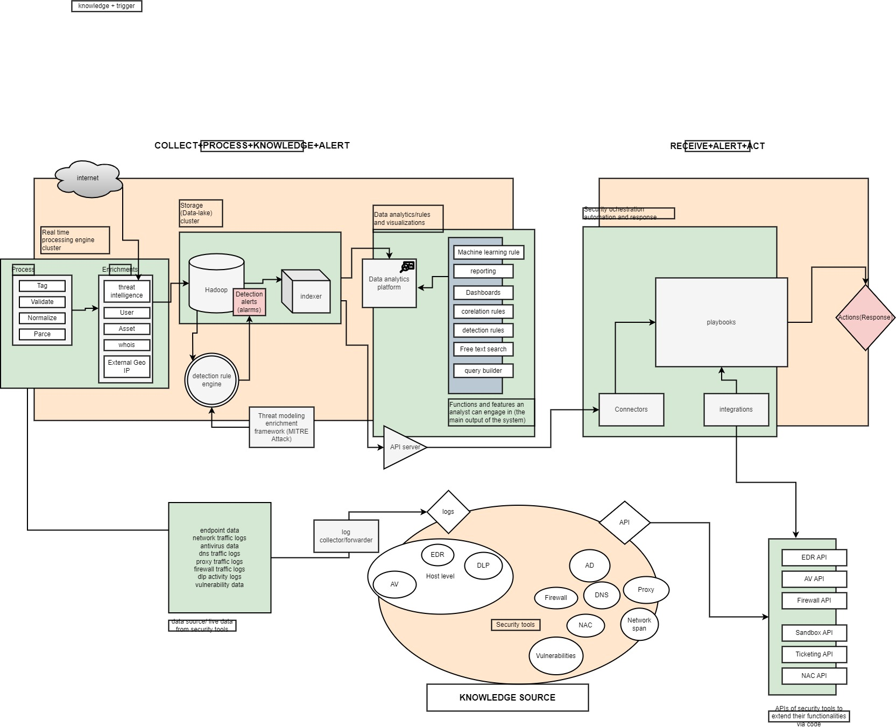

# Title: A Comprehensive Architecture for Cybersecurity Data Collection, Processing, Analysis, and Response

## Table of Contents
1. [Abstract](#abstract)
2. [Keywords](#keywords)
3. [Introduction](#introduction)
4. [Architecture Overview](#architecture-overview)
   - [Collect, Process, Knowledge, and Alert](#collect-process-knowledge-and-alert)
   - [Receive, Alert, and Act](#receive-alert-and-act)
   - [Knowledge Source](#knowledge-source)
5. [Overall Process Flow](#overall-process-flow)
6. [Conclusion](#conclusion)
7. [Acknowledgments](#acknowledgments)
8. [References](#references)

## Abstract
This paper presents a comprehensive architecture designed to enhance the capabilities of Security Operations Centers (SOCs) in collecting, processing, analyzing, and responding to cybersecurity threats. The architecture integrates advanced data processing techniques, threat intelligence enrichment, and automated response mechanisms to provide a robust defense against evolving cyber threats.

## Keywords
Cybersecurity, Data Processing, Threat Intelligence, Security Orchestration, Automation, Response (SOAR), Big Data, Machine Learning

## Introduction
In the current digital landscape, organizations face a myriad of cybersecurity threats that require sophisticated tools and processes for effective detection and response. This paper proposes an architecture that leverages real-time data processing, threat intelligence, and advanced analytics to provide a comprehensive solution for cybersecurity management.

## Architecture Overview
The proposed architecture is divided into three main sections: Collect, Process, Knowledge, and Alert; Receive, Alert, and Act; and Knowledge Source. Each section encompasses various components and functionalities essential for a robust cybersecurity posture.

### Collect, Process, Knowledge, and Alert
This section focuses on the initial stages of data collection and processing, leveraging real-time processing engines and threat intelligence enrichment to prepare data for analysis.

1. **Internet**: Data sources include open-source intelligence feeds, threat intelligence feeds, and public data repositories.
2. **Real-Time Processing Engine Cluster**: 
   - **Processes**: Tag, validate, normalize, and parse data.
   - **Threat Intelligence**: Enriches data with user behaviors, asset information, WHOIS, and geolocation data.
3. **Storage (Data Lake) Cluster**: Central repository for storing structured and unstructured data.
4. **Hadoop**: Processes detection alerts and alarms using big data capabilities.
5. **Detection Rule Engine**: Implements detection rules using frameworks like MITRE ATT&CK.
6. **Data Warehousing and Analysis**: Indexes data for efficient retrieval and analysis.
7. **Data Analytics Platform**: 
   - **Functions and Features**: Reporting, dashboards, correlation rules, detection rules, free text search, query builder, and machine learning rules.

### Receive, Alert, and Act
This section emphasizes the response mechanisms, utilizing Security Orchestration, Automation, and Response (SOAR) to manage incidents.

1. **Security Orchestration, Automation, and Response (SOAR)**: 
   - **Playbooks**: Pre-defined response strategies.
   - **Connectors**: Interfaces for communication between security tools.
   - **Integrations**: Seamless integration with existing security infrastructure.
2. **Actions/Response**: Combines manual and automated responses to mitigate threats.

### Knowledge Source
The knowledge source section aggregates logs and data from various security tools, providing a rich repository for analysis and response.

1. **Logs Collection/Forwarding**: Aggregates endpoint data, network traffic logs, antivirus logs, proxy/firewall logs, directory activity logs, and vulnerability data.
2. **Security Tools**: 
   - **Endpoint Detection and Response (EDR)**, **Antivirus (AV)**, **Data Loss Prevention (DLP)**, **Host-Level Security**.
   - **Active Directory (AD)**, **DNS**, **Proxy**, **Network Span**, **Network Access Control (NAC)**, **Vulnerabilities**.
3. **APIs of Security Tools**: Integrates with EDR API, AV API, Firewall API, Sandbox API, Ticketing API, NAC API, etc.

## Overall Process Flow
The architecture ensures a seamless flow of data from collection to response, enhancing the SOC's ability to detect and mitigate threats effectively.

1. **Data Collection**: Data is collected from the internet and various security tools, including endpoint and network traffic logs.
2. **Data Processing**: Processes the collected data for tagging, validation, normalization, and parsing.
3. **Threat Intelligence Enrichment**: Adds contextual information to the processed data.
4. **Storage and Big Data Processing**: Stores and processes data using Hadoop for further analysis.
5. **Detection and Analysis**: Applies detection rules and indexes data for quick retrieval.
6. **Analytics and Reporting**: Generates dashboards, reports, and visualizations for analysts.
7. **Incident Response**: Orchestrates response using SOAR, leveraging playbooks, connectors, and integrations.
8. **Knowledge Sharing**: Shares logs and security information among various tools and platforms through APIs.

## Conclusion
The proposed architecture provides a comprehensive approach to cybersecurity, integrating advanced data processing, threat intelligence, and automated response mechanisms. This architecture enhances the capabilities of SOCs, enabling them to effectively protect against and respond to cybersecurity threats.

## Acknowledgments
The authors would like to thank [Institution/Organization] for their support in this research.

## References
1. MITRE ATT&CK Framework. Available: [https://attack.mitre.org/](https://attack.mitre.org/)
2. Hadoop. Available: [https://hadoop.apache.org/](https://hadoop.apache.org/)
3. Security Orchestration, Automation, and Response (SOAR). Available: [https://www.gartner.com/en/information-technology/glossary/security-orchestration-automation-response-soar](https://www.gartner.com/en/information-technology/glossary/security-orchestration-automation-response-soar)
